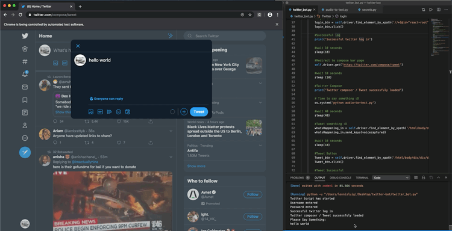

# Automated-Tweets
This python based tool was designed to help less able twitter users to tweet with more ease. 

Functions: Login using both user/email and password and send tweet

New Function: Speech Recongnition now available, users can now tweet via voice command

# Requirements

pip install selenium

pip install SpeechRecognition

pip install PyAudio

Download webdriver depending on what OS you're using: https://chromedriver.storage.googleapis.com/index.html?path=83.0.4103.39/ 

After downloading the chromedriver: mv chromedriver /usr/local/bin

# Demo

Username/Email

Password

Voice Capture

Voice Capture Curned To Text and Tweeted

Tweet

