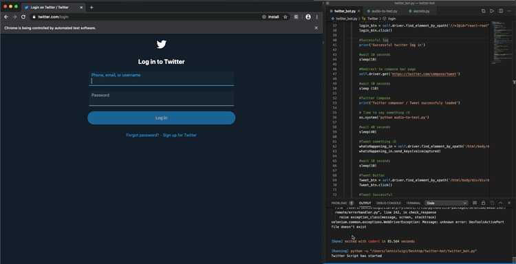

# Automated-Tweets
This python based tool was designed to help less able twitter users to tweet with more ease. 

Functions: Login using both user/email and password and send tweet

Additional functions will be added in due time

# Requirements

pip install selenium

pip install SpeechRecognition

pip install PyAudio

Download webdriver depending on what OS you're using: https://chromedriver.storage.googleapis.com/index.html?path=80.0.3987.16/ 

After downloading the chromedriver: mv chromedriver /usr/local/bin

# Demo

Video Demo: https://twitter.com/Lennis_Luigi/status/1223087847139430400?s=20 </>
